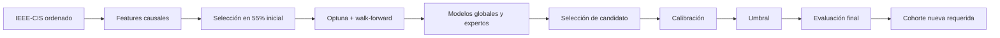
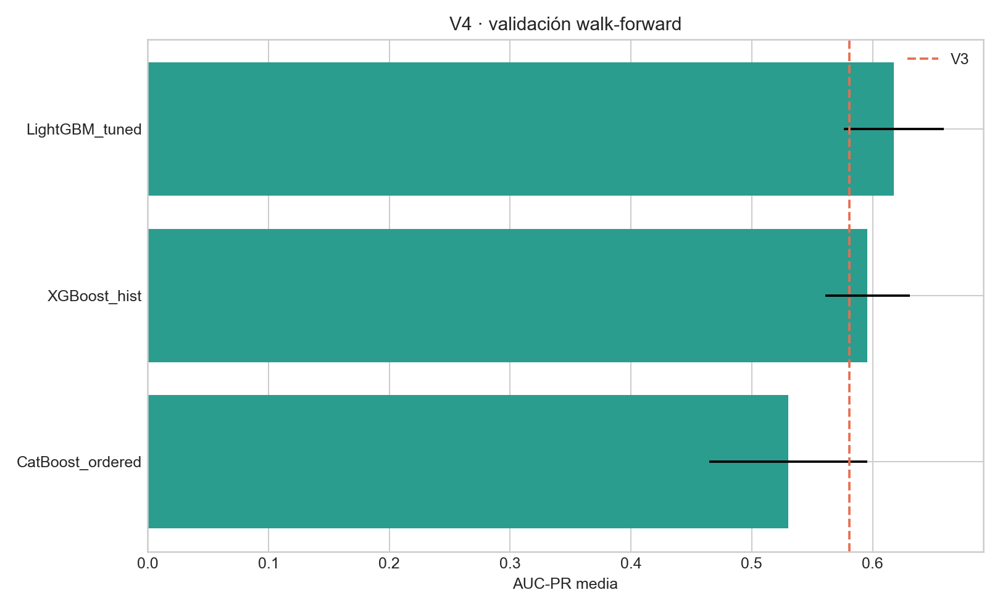
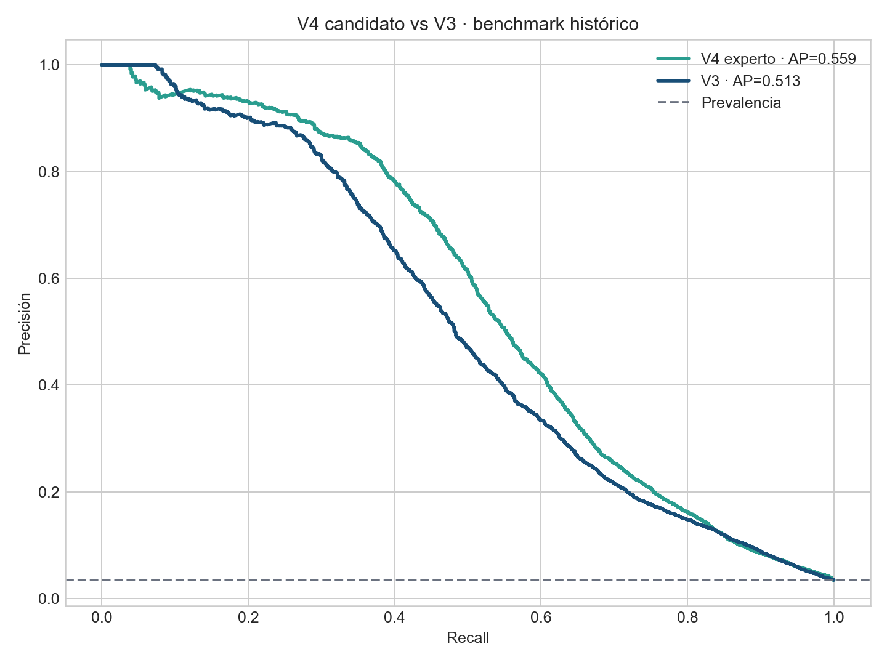

<div align="center">

# Proyecto 1 · Monitoreo transaccional — V4

### Detección de fraude con ingeniería causal, expertos segmentados y evaluación temporal


**Wilson Alejandro Calderón Argueta · 22018** · **Pablo Daniel Barillas Moreno · 22193**

Universidad del Valle de Guatemala · Deep Learning y Sistemas Inteligentes · Sección 30 · 2026

</div>

> [!IMPORTANT]
> V4 mejora todas las métricas operativas frente a V3 bajo la política robusta de recall, pero esa política se definió después de observar la primera evaluación V4. Por integridad experimental se conserva V3 como versión confirmada y se congela V4 para evaluarla, sin cambios, en una cohorte temporal nueva. El último 15 % de IEEE-CIS continúa siendo un benchmark histórico reutilizado, no un test ciego.

En consecuencia, **V4 es un candidato congelado**, no una promoción confirmatoria ni un sistema listo para producción.

## Contenido

- [Resumen ejecutivo](#resumen-ejecutivo)
- [Problema, datos y objetivo correcto](#problema-datos-y-objetivo-correcto)
- [Qué cambia en V4](#qué-cambia-en-v4)
- [Protocolo temporal](#protocolo-temporal)
- [Modelos y selección](#modelos-y-selección)
- [Resultados](#resultados)
- [Políticas de umbral](#políticas-de-umbral)
- [Correlación, PCA y deriva](#correlación-pca-y-deriva)
- [Estructura y reproducción](#estructura-y-reproducción)
- [Limitaciones y uso responsable](#limitaciones-y-uso-responsable)
- [Referencias APA 7](#referencias-apa-7)

## Resumen ejecutivo

El proyecto estudia 590,540 transacciones del conjunto IEEE-CIS Fraud Detection, con prevalencia de fraude de 3.50%. La V3 ya había demostrado que ampliar características y usar categorías nativas era más efectivo que aumentar una GRU cuya falsificación temporal mostraba poca señal de orden. V4 profundiza esa conclusión: integra 569 columnas después de ingeniería, selecciona 360 variables numéricas y 38 categóricas, optimiza LightGBM con 18 pruebas, compara CatBoost y XGBoost, construye una variante con hard negatives y entrena expertos separados para `ProductCD=W` y el resto.

LightGBM V4 alcanza AUC-PR walk-forward media **0.6175**, frente a **0.5809** en V3. La diferencia es **+0.0366** y la ROC-AUC media llega a 0.9220. En el bloque final separado, el candidato seleccionado antes de calibrar y fijar umbral es `LightGBM_expertos_ProductCD`, con AUC-PR **0.5491** y ROC-AUC **0.9012**.

La política robusta `recall ≥ 0.75`, fijada sobre un bloque anterior, produce precisión **20.24%**, recall **76.52%**, F1 **0.3201** y costo **Q605,520**. Frente a V3, mejora AUC-PR 0.1041, ROC-AUC 0.0112, precisión 3.97%, recall 5.56%, F1 0.0554 y reduce el costo 18.53%. La mejora pareada de AUC-PR tiene IC 95 % [0.0696, 0.1426].

## Problema, datos y objetivo correcto

El fraude es una clasificación binaria extremadamente desbalanceada. Una accuracy alta no demuestra utilidad: predecir todas las transacciones como legítimas superaría 96 % de accuracy y detectaría cero fraudes. Por ello el proyecto prioriza AUC-PR, precisión, recall, F1, costo y métricas `Precision@K/Recall@K`. ROC-AUC se reporta como medida complementaria y V4 supera el objetivo 0.90, pero no se presenta como sustituto de la curva Precision–Recall.

Las tablas `train_transaction.csv` y `train_identity.csv` se unen únicamente por `TransactionID`. Las observaciones se ordenan por `TransactionDT`; ambos campos se excluyen como magnitudes predictivas. Para una operación en tiempo $t$, toda variable histórica cumple:

$$
x_t^{hist}=f(\{x_j:t_j<t\}).
$$

El falso negativo tiene costo académico Q4,200 y el falso positivo Q180. La relación 23.3:1 explica por qué la política recomendada exige un buffer de recall en vez de maximizar exclusivamente precisión.

## Qué cambia en V4

V4 incorpora 135 variables derivadas adicionales, entre ellas calendario, forma decimal y primer dígito del monto, resúmenes por bloques `V/C/D`, normalizaciones `D_i-día`, logaritmos `C_i`, frecuencias estrictamente previas, cambios de dispositivo/dirección/correo, familias de navegador y dispositivo, y estadísticas históricas para cuatro identidades proxy: tarjeta–dirección, tarjeta–correo, tarjeta–dispositivo y tarjeta–producto.

No se introduce un ID como variable continua. Las claves proxy solo sirven para producir conteos, montos previos, dispersión, razones y recencia. Los valores faltantes se preservan, porque el patrón de ausencia puede tener señal, pero también se documenta que esa señal puede cambiar con el proceso de captura.

La selección utiliza exclusivamente el 55 % cronológico inicial. Se eliminan constantes, columnas presentes en menos de 0.5 % de ese tramo y sustitutos casi idénticos con $|\rho_s|\ge0.999$. La baja correlación marginal con fraude no obliga a excluir una característica: LightGBM puede aprovechar interacciones no lineales. PCA permanece como ablation lineal; en V3 conservó 99.53 % de la varianza y redujo AUC-PR, evidencia de que varianza total no equivale a información discriminativa.

## Protocolo temporal

El orden experimental es 70 % entrenamiento, 15 % validación y 15 % benchmark histórico reutilizado. Dentro de validación, V4 separa bloques para early stopping, entrenamiento del stacking, selección de candidato, calibración, selección de umbral y evaluación. Los tres folds walk-forward nunca entrenan con eventos posteriores al bloque evaluado.



El modelo adversarial distingue train de validación con ROC-AUC 1.0, dominado por `day_index` y otras variables temporales acumulativas. No significa que el clasificador de fraude sea perfecto: demuestra una deriva temporal fuerte y justifica ponderación por recencia, walk-forward y monitoreo por períodos.

## Modelos y selección

| Modelo | AUC-PR walk-forward | Desviación |
|---|---:|---:|
| LightGBM_tuned | 0.6175 | 0.0412 |
| XGBoost_hist | 0.5957 | 0.0349 |
| CatBoost_ordered | 0.5302 | 0.0654 |

LightGBM fue optimizado con Optuna sobre learning rate, hojas, profundidad, mínimo por hoja, submuestreo, regularización y suavizado categórico. XGBoost y CatBoost se ejecutaron con presupuestos piloto uniformes de 220 y 120 iteraciones respectivamente, después de comprobar que una configuración CatBoost mayor excedía 20 minutos por fold. Por tanto, son controles de diversidad y no búsquedas exhaustivas.

La selección final ocurre en el bloque 50–60 % de validación, antes de calibración, umbral y evaluación:

| Candidato | AUC-PR selección | ROC-AUC selección |
|---|---:|---:|
| LightGBM_expertos_ProductCD | 0.6078 | 0.9213 |
| Stacking_experimental | 0.6007 | 0.9016 |
| LightGBM_hard_negative | 0.5885 | 0.9197 |
| XGBoost_piloto | 0.5826 | 0.9324 |
| LightGBM_global | 0.5820 | 0.9187 |
| CatBoost_piloto | 0.4855 | 0.9050 |

El experto por `ProductCD` gana con AUC-PR 0.6078. El stacking experimental queda segundo y no se recomienda: en evaluación redujo ROC-AUC a 0.8686, señal de sobreajuste del metamodelo. Esta conclusión negativa se conserva porque evita presentar complejidad adicional como mejora automática.

## Resultados

| Modelo/política | AUC-PR | ROC-AUC | Precisión | Recall | F1 | Costo |
|---|---:|---:|---:|---:|---:|---:|
| V3, bloque comparable | 0.445 | 0.890 | 16.27% | 70.96% | 0.265 | Q743,280 |
| **V4 experto, política robusta** | **0.549** | **0.901** | **20.24%** | **76.52%** | **0.320** | **Q605,520** |
| V4, benchmark histórico | 0.559 | 0.901 | 21.52% | 73.99% | 0.333 | Q4,866,000 |





En el benchmark histórico V4 logra AUC-PR 0.5592 y ROC-AUC 0.9013. La diferencia pareada de AUC-PR V4–V3 es 0.0467, IC descriptivo [0.0327, 0.0605. Este resultado apoya consistencia, pero no constituye confirmación ciega.

## Políticas de umbral

| Política | Umbral | Precisión | Recall | F1 | Costo evaluación |
|---|---:|---:|---:|---:|---:|
| balanceado_recall_070 | 0.07768 | 24.82% | 68.94% | 0.365 | Q665,460 |
| robusto_recall_075_post_hoc | 0.05664 | 20.24% | 76.52% | 0.320 | Q605,520 |
| economico | 0.03612 | 14.20% | 81.31% | 0.242 | Q661,080 |

La política balanceada maximiza F1 con recall mínimo 0.70 en el bloque de umbral. La robusta exige 0.75 para absorber deriva y es la recomendada para la siguiente cohorte. La económica minimiza $4200FN+180FP$ y recupera más fraude, pero reduce precisión y F1. Ningún umbral modifica AUC-PR o ROC-AUC; únicamente el punto operativo.

En capacidad limitada, V4 obtiene precisión superior a 0.90 al revisar el 1 % de mayor riesgo y recupera aproximadamente 26 % del fraude. Esto sí es una métrica ≥0.90 válida, pero debe expresarse como `Precision@1%`, no como precisión poblacional.

## Correlación, PCA y deriva

La poda de correlación se usa para redundancia, no para confundir correlación con causalidad o relevancia. Se conserva una sola variable cuando dos candidatas tienen Spearman absoluto ≥0.999. Para árboles, PCA no es la representación principal porque destruye interpretabilidad y puede diluir señal minoritaria. Para modelos lineales continúa siendo un control válido.

La deriva adversarial perfecta exige cautela. Variables temporales explícitas permiten distinguir períodos casi sin error, y las frecuencias acumulativas cambian necesariamente con el tiempo. En una siguiente iteración deben reportarse dos auditorías: deriva total operacional y deriva residual excluyendo marcadores temporales explícitos. También se debe vigilar estabilidad de umbral, prevalencia, PSI, faltantes y métricas por producto/dispositivo.

## Estructura y reproducción

```text
codigo/                  pipelines y auditorías V3/V4
configuracion/v4/        dependencias e instrucciones V4
datos/raw/               IEEE-CIS local, ignorado por Git
datos/processed/v4/      selección y correlación
artefactos/v4/           modelos, predicciones y resultados
evidencia/figuras/v4/    gráficos reproducibles
entregables/cuaderno/    notebook ejecutable
entregables/informe/     LaTeX y PDF
entregables/presentacion/HTML y PDF de 8 diapositivas
entregables/ficha/       ficha DOCX/PDF del repositorio
```

```powershell
py -3.13 -m venv .venv
.\.venv\Scripts\Activate.ps1
python -m pip install -r configuracion/v4/requirements-v4.txt
python -m pip install -r configuracion/v4/requirements-docs-v4.txt
python codigo/download_data.py
python -u codigo/proyecto1_v4_pipeline.py
python codigo/postprocess_v4.py
python codigo/build_v4_deliverables.py
jupyter nbconvert --to notebook --execute --inplace --ExecutePreprocessor.timeout=300 entregables/cuaderno/Proyecto_1_Monitoreo_Transaccional_V4.ipynb
python codigo/audit_project1_v4.py
```

La fuente única es [`artefactos/v4/resultados_v4.json`](../artefactos/v4/resultados_v4.json). Las instrucciones completas están en [`configuracion/v4/INSTRUCCIONES_V4.md`](../configuracion/v4/INSTRUCCIONES_V4.md).

## Limitaciones y uso responsable

V4 no identifica personas reales: sus identidades son claves proxy que pueden mezclar usuarios o fragmentar uno mismo. IEEE-CIS está anonimizado, cubre un período limitado y no representa automáticamente otro país, comercio o época. Los costos son supuestos académicos. No se estudiaron consecuencias legales, privacidad, seguridad adversarial, explicaciones individuales, latencia productiva ni sesgos sobre atributos no disponibles.

El modelo debe priorizar revisión humana, nunca atribuir culpabilidad ni bloquear transacciones de forma autónoma. Antes de producción se requieren una nueva cohorte, calibración con costos reales, análisis de impacto, trazabilidad de decisiones, controles de acceso, monitoreo y un procedimiento de apelación. La política robusta se considera post-hoc; debe congelarse sin ajustes y validarse una sola vez en datos nuevos.

## Referencias APA 7

Akiba, T., Sano, S., Yanase, T., Ohta, T., & Koyama, M. (2019). Optuna: A next-generation hyperparameter optimization framework. *Proceedings of the 25th ACM SIGKDD International Conference on Knowledge Discovery & Data Mining*, 2623–2631. https://doi.org/10.1145/3292500.3330701

Chen, T., & Guestrin, C. (2016). XGBoost: A scalable tree boosting system. *Proceedings of the 22nd ACM SIGKDD International Conference on Knowledge Discovery and Data Mining*, 785–794. https://doi.org/10.1145/2939672.2939785

IEEE Computational Intelligence Society. (2019). *IEEE-CIS Fraud Detection* [Data set]. Kaggle. https://www.kaggle.com/competitions/ieee-fraud-detection

Ke, G., Meng, Q., Finley, T., Wang, T., Chen, W., Ma, W., Ye, Q., & Liu, T.-Y. (2017). LightGBM: A highly efficient gradient boosting decision tree. *Advances in Neural Information Processing Systems, 30*.

Prokhorenkova, L., Gusev, G., Vorobev, A., Dorogush, A. V., & Gulin, A. (2018). CatBoost: Unbiased boosting with categorical features. *Advances in Neural Information Processing Systems, 31*.

Saito, T., & Rehmsmeier, M. (2015). The precision-recall plot is more informative than the ROC plot when evaluating binary classifiers on imbalanced datasets. *PLOS ONE, 10*(3), e0118432. https://doi.org/10.1371/journal.pone.0118432

## Declaración de asistencia

Se utilizó asistencia de IA para desarrollo, redacción, visualización y auditoría. Los integrantes ejecutaron los experimentos, revisaron los artefactos y asumen responsabilidad por las decisiones y conclusiones.
