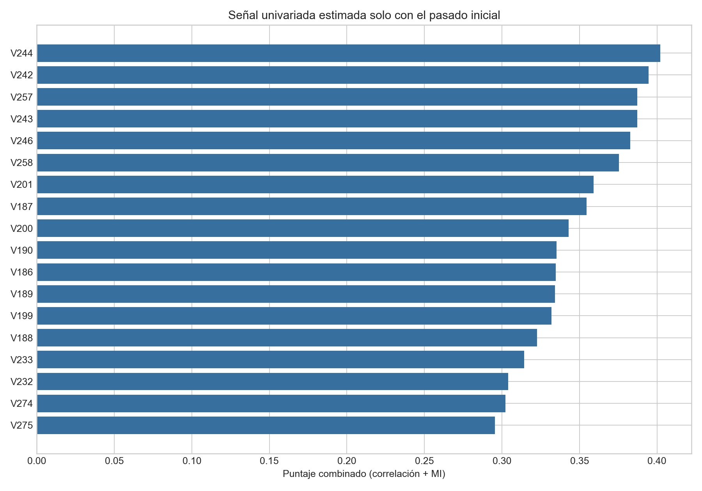
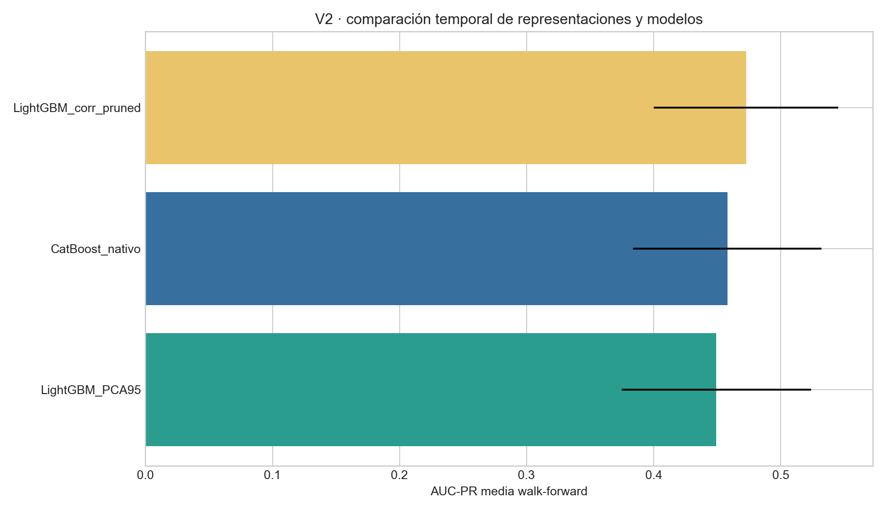
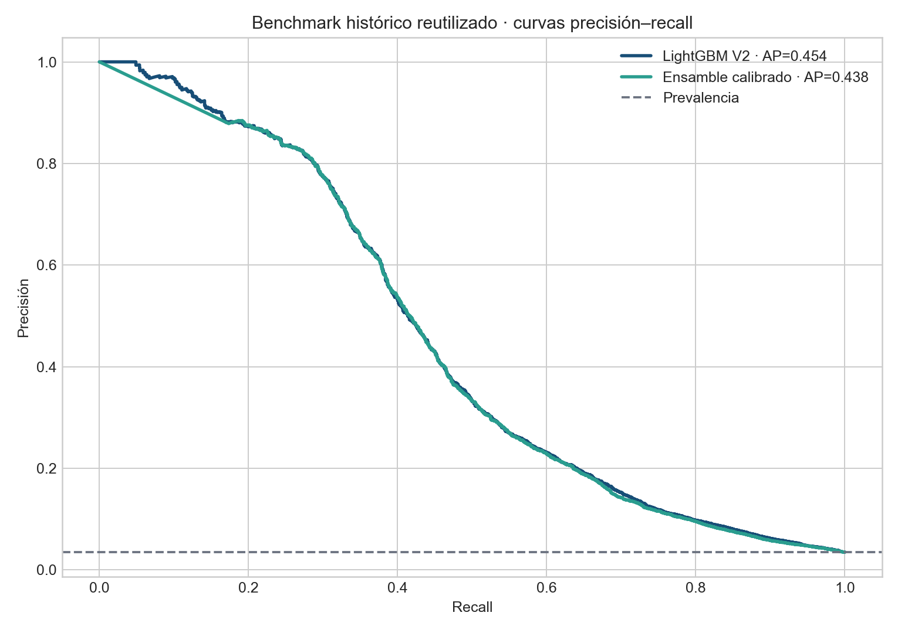
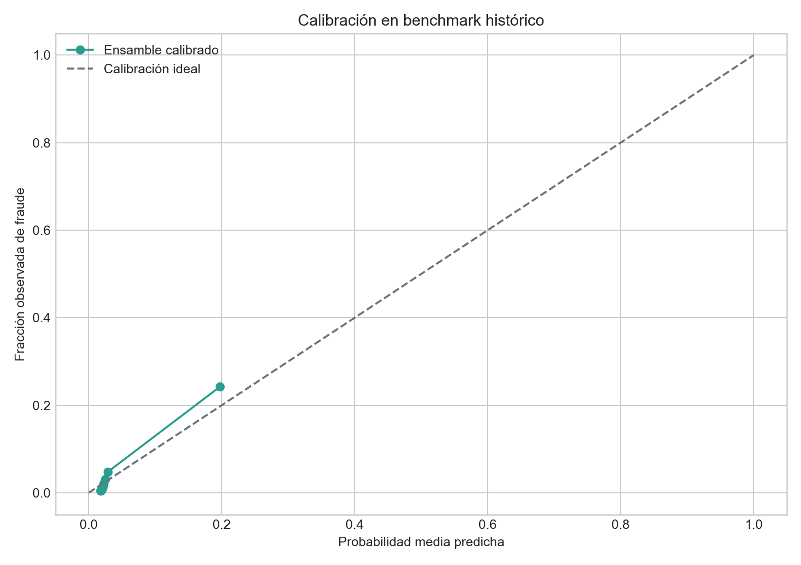

<div align="center">

# Proyecto 1 · Monitoreo transaccional con aprendizaje profundo

### Variables causales, validación temporal y decisión económica


**Wilson Alejandro Calderón Argueta · 22018** · **Pablo Daniel Barillas Moreno · 22193**

Universidad del Valle de Guatemala · Deep Learning y Sistemas Inteligentes · Sección 30 · 2026

</div>

> [!IMPORTANT]
> El último 15% cronológico es un **benchmark histórico reutilizado**: ya fue observado en V1 y no se presenta como test ciego. La selección y comparación se realizan en ventanas anteriores.

## Contenido

- [Resumen ejecutivo](#resumen-ejecutivo)
- [Datos y fuga temporal](#datos-y-fuga-temporal)
- [De V1 a V2](#de-v1-a-v2)
- [Correlación, selección y PCA](#correlación-selección-y-pca)
- [Protocolo y resultados](#protocolo-y-resultados)
- [Economía, calibración y capacidad](#economía-calibración-y-capacidad)
- [Reproducción y estructura](#reproducción-y-estructura)
- [Limitaciones, ética y referencias](#limitaciones-ética-y-referencias)

## Resumen ejecutivo

El proyecto estudia detección de fraude en 590,540 transacciones de IEEE-CIS, distribuidas durante 182.0 días, con prevalencia 3.50%. Debido al desbalance, AUC-PR es la métrica principal de ranking. La decisión operativa usa un supuesto académico de Q4,200 por falso negativo y Q180 por falso positivo; omitir fraude pesa 23.3 veces más que generar una alerta innecesaria.

La V2 amplía la lectura desde 24 columnas en V1 hasta todas las variables transaccionales y de identidad disponibles, pero evita incorporarlas ciegamente. Cada candidata se evalúa por ausencia, cardinalidad, varianza, Pearson, Spearman, información mutua y redundancia. `TransactionID` solo une tablas y `TransactionDT` solo ordena. Los códigos de tarjeta, dirección y dispositivo se tratan como categorías o componentes de una identidad aproximada, no como magnitudes continuas.

El ganador interno fue **LightGBM_corr_pruned**. LightGBM V2 alcanza AUC-PR 0.4536 en el benchmark histórico; el ensamble calibrado, 0.4379. El intervalo descriptivo por bloques temporales de LightGBM V2 es [0.4113, 0.4918]. Estas cifras facilitan continuidad con V1, pero una afirmación confirmatoria requiere una cohorte nueva.

## Datos y fuga temporal

`train_transaction.csv` y `train_identity.csv` se integran uno-a-uno mediante `TransactionID`. El pipeline ordena por `TransactionDT` y después por la llave. Para el evento actual $t$, toda variable histórica cumple:

$$x_t^{hist}=f\left(\{x_j:t_j<t\}\right).$$

Se construyen conteo previo, promedio y desviación histórica de monto, razón monto/promedio, tiempo desde la transacción anterior y actividad en 1, 6, 24 y 72 horas. La estadística se emite antes de incorporar el evento actual. Imputación, codificación, reducción, modelo, calibración y umbral se ajustan con pasado únicamente.


### Cobertura de identidades aproximadas

| Proxy | Entidades | Mediana | ≥3 | ≥8 | ≥16 |
|---|---:|---:|---:|---:|---:|
| Tarjeta Direccion | 42,946 | 2.0 | 94.9% | 87.7% | 80.2% |
| Tarjeta Direccion Correo | 92,690 | 2.0 | 87.4% | 73.0% | 60.5% |
| Tarjeta Dispositivo Producto | 44,308 | 1.0 | 93.8% | 87.9% | 83.0% |
| Tarjeta Dispositivo | 38,600 | 2.0 | 94.8% | 89.3% | 84.6% |

Estas claves pueden mezclar personas o fragmentar una misma persona. La tabla informa si una arquitectura secuencial realmente dispone de historia; más longitud nominal no ayuda cuando la mayoría de entidades carece de antecedentes.

## De V1 a V2

| Dimensión | V1 preservada | V2 |
|---|---|---|
| Variables leídas | 21 transacción + 3 identidad | 394 transacción + 41 identidad |
| Muestra tabular | máximo 180,000 | 180k, 300k y todo el 70% |
| Validación | corte único | tres ventanas walk-forward |
| Reducción | selección manual | correlación, MI, redundancia y PCA |
| Baseline | HistGradientBoosting | LightGBM y CatBoost |
| Riesgo | umbral por costo | calibración, Brier, ECE y holdout |
| Evidencia | AP, costo, permutación | además CI, top-k, deriva y segmentos |

V1 no se borra ni reescribe: modelos, figuras, código y resultados se congelan en carpetas `v1`. La permutación del orden en V1 redujo AUC-PR apenas 0.0017 y usar tres eventos rindió casi igual que ocho; por eso una GRU más profunda no fue la primera intervención.

## Correlación, selección y PCA

Pearson detecta asociación lineal; Spearman, monotonía; información mutua, dependencia no lineal. Ninguna prueba causalidad. La correlación se usa para comprender señal y quitar redundancia, no para eliminar automáticamente todo predictor con correlación marginal pequeña: interacciones y no linealidades pueden volverlo útil.

Se retuvieron 110 numéricas y 18 categóricas. Se descartaron 53 por $|\rho_s|\geq 0.985$. Cada exclusión queda registrada en `datos/processed/v2`.

PCA se ajusta dentro de cada fold, únicamente en variables numéricas elegibles, después de imputar y escalar. Nunca incluye etiqueta, orden, IDs o categorías. Conservar 95% de varianza no equivale a conservar señal de fraude; PCA solo se adopta si mejora establemente fuera de tiempo.



## Protocolo y resultados

Tres ventanas simulan reentrenamientos consecutivos: siempre entrenan con el pasado y evalúan el bloque posterior. CatBoost conserva categorías nativas; LightGBM modela la representación depurada; LightGBM+PCA mide compresión. El presupuesto CatBoost de 240 iteraciones es transparente y no pretende representar una búsqueda exhaustiva.

| Modelo | AP media | Desv. | ROC-AUC | Tiempo |
|---|---:|---:|---:|---:|
| LightGBM_corr_pruned | 0.4727 | 0.0725 | 0.8641 | 24.8 s |
| CatBoost_nativo | 0.4580 | 0.0742 | 0.8558 | 398.6 s |
| LightGBM_PCA95 | 0.4494 | 0.0747 | 0.8596 | 33.4 s |



### Benchmark histórico reutilizado

| Modelo | AUC-PR | Precisión | Recall | F1 | Costo | Alertas/100k |
|---|---:|---:|---:|---:|---:|---:|
| LightGBM V2 | 0.454 | 14.88% | 70.29% | 0.246 | Q6,078,120 | 16,438 |
| Ensamble calibrado | 0.438 | 14.12% | 70.19% | 0.235 | Q6,228,600 | 17,299 |



El ensamble combina el score tabular con agregados causales mediante regresión logística. No se denomina A+B-GRU, porque no usa predicciones out-of-fold de una GRU V2. Esta distinción evita presentar como realizado un experimento pendiente.

La comparación reproducible completa con A, B y C de V1 se encuentra en [`artefactos/v2/comparacion_v1_v2.csv`](../artefactos/v2/comparacion_v1_v2.csv). Frente a A-V1, LightGBM V2 gana 0.0251 de AUC-PR y reduce Q115,500 de costo (1.86%), pero pierde 0.0188 de recall; por eso la mejora no se presenta como dominancia en todas las métricas.

## Economía, calibración y capacidad

El umbral minimiza $C(\tau)=4200FN(\tau)+180FP(\tau)$ en un holdout cronológico. Mejor F1 no garantiza menor costo: perder recall puede ser más grave que reducir falsos positivos. Brier y Expected Calibration Error evalúan si la escala del score representa riesgo de manera razonable; calibración no necesariamente cambia AUC-PR, que depende del orden.



`Precision@K` y `Recall@K` traducen ranking a capacidad de revisión para 0.1%, 0.5%, 1% y 2% de transacciones. También se guardan resultados por producto, dispositivo y cuartil de monto, junto con deriva de prevalencia, monto y ausencia. En operación se debe inspeccionar especialmente falsos negativos de alto monto y estabilidad del umbral.

## Reproducción y estructura

```powershell
py -3.13 -m venv .venv
.\.venv\Scripts\Activate.ps1
python -m pip install -r configuracion/v2/requirements-v2.txt
python -m pip install -r configuracion/v2/requirements-docs-v2.txt
python codigo/download_data.py
python -u codigo/proyecto1_v2_pipeline.py
python codigo/postprocess_v2.py
python codigo/compare_versions.py
python codigo/deliverables_v2.py
python codigo/crear_ficha_repositorio_v2.py
python codigo/audit_project1_v2.py
```

```text
.github/                 README visible en GitHub
artefactos/v1|v2/        evidencia congelada y fuente única
codigo/v1/               scripts originales preservados
codigo/                  pipeline y constructores V2
configuracion/v2/        dependencias exactas y guía
datos/raw/               CSV locales ignorados por Git
datos/processed/v2/      auditorías y selección
entregables/             notebook, informe, slides y ficha
evidencia/figuras/v1|v2/ gráficos separados por versión
legal/                   licencia
```

## Limitaciones, ética y referencias

- El benchmark reutilizado no es test ciego.
- La identidad proxy puede colisionar o fragmentar usuarios.
- Las columnas anonimizadas limitan interpretación semántica.
- Correlación e información mutua no demuestran causalidad.
- El presupuesto CatBoost es acotado y el costo es académico.
- El prototipo prioriza revisión humana; no debe rechazar operaciones ni atribuir culpabilidad.

### Model Card

**Uso previsto:** priorización académica de alertas. **No previsto:** decisión financiera automática. **Salida:** score y alerta según umbral. **Monitoreo:** AP, recall, costo, Brier/ECE, alertas/100k, deriva y segmentos. Antes de producción se requieren datos recientes, privacidad, seguridad, explicabilidad, análisis de sesgo y costos reales.

### Referencias APA 7

Bai, S., Kolter, J. Z., & Koltun, V. (2018). *An empirical evaluation of generic convolutional and recurrent networks for sequence modeling*. arXiv. https://doi.org/10.48550/arXiv.1803.01271

Ke, G., Meng, Q., Finley, T., Wang, T., Chen, W., Ma, W., Ye, Q., & Liu, T.-Y. (2017). LightGBM: A highly efficient gradient boosting decision tree. *Advances in Neural Information Processing Systems, 30*. https://papers.neurips.cc/paper/6907-lightgbm-a-highly-efficient-gradient-boosting-decision-tree

Prokhorenkova, L., Gusev, G., Vorobev, A., Dorogush, A. V., & Gulin, A. (2018). CatBoost: Unbiased boosting with categorical features. *Advances in Neural Information Processing Systems, 31*. https://proceedings.neurips.cc/paper/2018/hash/14491b756b3a51daac41c24863285549-Abstract.html

Saito, T., & Rehmsmeier, M. (2015). The precision-recall plot is more informative than the ROC plot when evaluating binary classifiers on imbalanced datasets. *PLOS ONE, 10*(3), e0118432. https://doi.org/10.1371/journal.pone.0118432

Scikit-learn developers. (2026). *Probability calibration*. https://scikit-learn.org/stable/modules/calibration.html

### Declaración de IA

Se utilizó IA para estructurar código, redacción, visualización y controles de consistencia. Los autores ejecutan el experimento, verifican cifras y asumen responsabilidad por interpretación, seguridad y defensa. La IA no se considera fuente académica.
