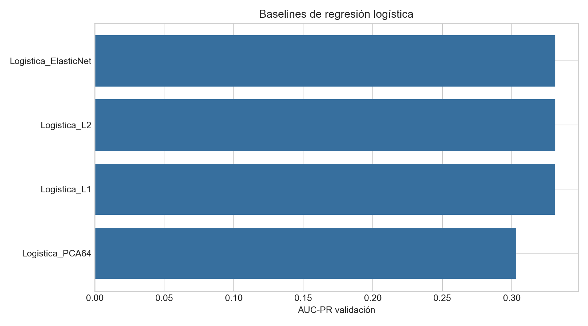
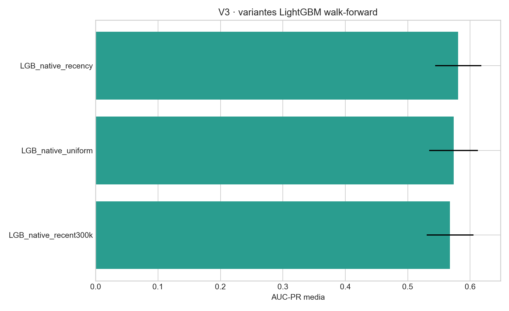
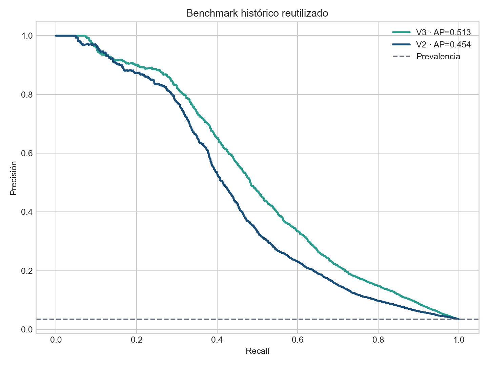
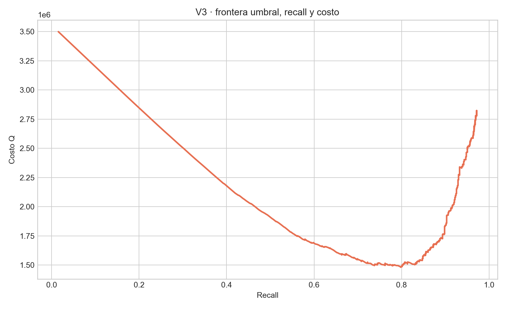

<div align="center">

# Proyecto 1 · Monitoreo transaccional — V3

### Detección de fraude con variables causales, LightGBM nativo y validación temporal


**Wilson Alejandro Calderón Argueta · 22018** · **Pablo Daniel Barillas Moreno · 22193**

Universidad del Valle de Guatemala · Deep Learning y Sistemas Inteligentes · Sección 30 · 2026

</div>

> [!IMPORTANT]
> V3 cumplió los cuatro criterios predefinidos de promoción. El último 15% cronológico continúa siendo un **benchmark histórico reutilizado**, no una prueba ciega. La promoción se decidió con tres ventanas walk-forward y un holdout de umbral anterior al benchmark.

## Contenido

- [Resumen ejecutivo](#resumen-ejecutivo)
- [Problema y datos](#problema-y-datos)
- [Qué cambió en V3](#qué-cambió-en-v3)
- [Correlación, PCA y regresión logística](#correlación-pca-y-regresión-logística)
- [Protocolo temporal](#protocolo-temporal)
- [Resultados](#resultados)
- [Umbrales y decisión económica](#umbrales-y-decisión-económica)
- [Operación, ética y limitaciones](#operación-ética-y-limitaciones)
- [Reproducción](#reproducción)
- [Referencias APA 7](#referencias-apa-7)

## Resumen ejecutivo

El proyecto estudia detección de fraude sobre **590,540 transacciones** IEEE-CIS, con **3.50%** de prevalencia y 434 columnas integradas. La tarea es fuertemente desbalanceada; por ello la métrica de ranking principal es AUC-PR y no exactitud. La decisión operativa se complementa con precisión, recall, F1, calibración, capacidad de revisión y un costo académico de Q4,200 por falso negativo y Q180 por falso positivo.

V3 se promueve porque no depende de una mejora aislada. Ganó las tres ventanas temporales, elevó AUC-PR walk-forward de **0.4727 a 0.5809**, redujo el costo del holdout de **Q1,901,700 a Q1,544,760** y aumentó recall de **63.48% a 70.21%**. Los cuatro criterios de promoción resultaron verdaderos.

En el benchmark histórico reutilizado, el umbral balanceado de V3 logra AUC-PR **0.5125**, precisión **19.05%**, recall **72.69%**, F1 **0.3019** y costo **Q5,250,540**. Frente a V2 mejora todas esas métricas y reduce el costo 13.62%. Esta comparación es descriptiva; la evidencia confirmatoria requerirá una cohorte temporal nueva.

## Problema y datos

Los archivos `train_transaction.csv` y `train_identity.csv` se integran mediante `TransactionID` y se ordenan con `TransactionDT`. Ninguna de estas dos columnas entra al modelo como una magnitud predictiva: la primera es una llave técnica y la segunda define el orden. Las tarjetas, direcciones, dominios y dispositivos son códigos anonimizados; se tratan como categorías o componentes de una identidad proxy.

Para una transacción en tiempo $t$, las variables históricas cumplen:

$$x_t^{hist}=f\left(\{x_j:t_j<t\}\right).$$

Se calculan causalmente conteo previo, media y desviación histórica del monto, razón entre monto actual y promedio anterior, tiempo desde la operación previa y conteos en 1, 6, 24 y 72 horas. El evento actual se incorpora al historial solamente después de emitir sus variables. Esto evita que una observación se describa usando su propio futuro.

La clave principal `card1 + card2 + card3 + card5 + addr1` produce 42,946 entidades aproximadas. No equivale a una persona real: puede mezclar usuarios o fragmentar uno mismo. La cobertura histórica se reporta para advertir que una secuencia nominalmente larga no implica antecedentes confiables.

## Qué cambió en V3

| Dimensión | V2 | V3 promovida |
|---|---|---|
| Numéricas | 110 | 220 |
| Categóricas | 18 codificadas como enteros | 24 categorías nativas |
| Valores faltantes | mediana | `NaN` nativo + conteo de ausencia |
| Redundancia | $|\rho_s|≥0.985$ | $|\rho_s|≥0.995$ |
| Entrenamiento | uniforme | uniforme, recencia y 300k recientes |
| Baseline lineal | solo dentro del ensamble | L2, L1, Elastic Net y PCA independientes |
| Umbral | costo en validación completa | early stopping, calibración y umbral en bloques separados |
| Segmentos | ensamble no recomendado | candidato V3 recomendado |
| Promoción | comparación descriptiva | regla de cuatro criterios congelados |

LightGBM recibe categorías declaradas como tales, no códigos ordinales cuyo orden sería artificial. Los valores numéricos faltantes se conservan para que el árbol pueda aprender rutas específicas de ausencia. Además, la ponderación exponencial con vida media de 75 días permite que observaciones recientes influyan más sin descartar por completo el pasado.

## Correlación, PCA y regresión logística

La selección se aprende únicamente en el 55% inicial. Pearson describe asociación lineal, Spearman asociación monótona e información mutua dependencias no lineales. Ninguna implica causalidad. Una correlación marginal baja tampoco basta para excluir una variable, porque los árboles pueden explotar interacciones. La poda solo retira sustitutos casi monotónicos y excluye IDs, constantes o ausencia extrema.

PCA continúa como ablación, no como supuesto de mejora. En V2 redujo dimensión, pero perdió AUC-PR. En V3, la logística con 64 componentes explicó 99.53% de la varianza numérica y obtuvo AUC-PR 0.3032. Conservar varianza no equivale a conservar señal discriminativa.

| Baseline | AUC-PR validación | ROC-AUC | Dimensión | Convergió |
|---|---:|---:|---:|---|
| Logistica_ElasticNet | 0.3312 | 0.7632 | 274 | No |
| Logistica_L2 | 0.3312 | 0.7631 | 274 | No |
| Logistica_L1 | 0.3310 | 0.7632 | 274 | No |
| Logistica_PCA64 | 0.3032 | 0.7237 | 64 | Sí |

Las variantes `saga` alcanzaron el límite de 100 iteraciones, por lo que se documentan como controles lineales no convergidos y no como optimizaciones exhaustivas. Aun así, su AUC-PR cercana a 0.331 muestra que gran parte de la ventaja de V3 proviene de interacciones no lineales y particiones categóricas, no solo de incorporar más columnas.



## Protocolo temporal

Las tres ventanas walk-forward siempre entrenan con pasado y evalúan el futuro inmediato. Dentro de cada ventana se aprenden categorías, poda, pesos y early stopping sin incorporar observaciones posteriores. El benchmark final no decide el modelo ni sus hiperparámetros.

| Modelo | AUC-PR media | Desviación |
|---|---:|---:|
| LGB_native_recency | 0.5809 | 0.0369 |
| LGB_native_uniform | 0.5735 | 0.0390 |
| LGB_native_recent300k | 0.5679 | 0.0376 |

La variante con recencia ganó F1, F2 y F3. La mejora no se explica únicamente por usar menos o más filas: el modelo uniforme también supera claramente a V2, mientras el entrenamiento con 300 mil recientes queda detrás de ponderar suavemente todo el pasado.



## Resultados

| Versión | Modelo | AUC-PR | Precisión | Recall | F1 | Costo |
|---|---|---:|---:|---:|---:|---:|
| V1 | HistGradientBoosting A | 0.429 | 13.39% | 72.17% | 0.226 | Q6,193,620 |
| V2 | LightGBM depurado | 0.454 | 14.88% | 70.29% | 0.246 | Q6,078,120 |
| **V3** | **LightGBM nativo + recencia** | **0.513** | **19.05%** | **72.69%** | **0.302** | **Q5,250,540** |

La diferencia pareada de AUC-PR V3−V2 en el benchmark es 0.0589, con intervalo descriptivo por bloques [0.0431, 0.0748]. Que el intervalo quede por encima de cero refuerza la consistencia descriptiva, aunque no convierte al benchmark reutilizado en prueba ciega.



## Umbrales y decisión económica

El umbral principal, **0.05220**, maximiza F1 dentro del holdout sujeto a recall mínimo de 70%. Es el punto recomendado porque mejora simultáneamente precisión, recall, F1 y costo frente a V2. Produce 13,281 alertas por 100 mil transacciones.

El umbral económico alternativo, **0.03164**, minimiza:

$$C(\tau)=Q4,200\,FN(\tau)+Q180\,FP(\tau).$$

En el benchmark recupera 81.09% del fraude y reduce el costo a Q5,168,040, pero genera más alertas y baja precisión. Por ello no existe un único “mejor” umbral independiente de capacidad operativa. La política balanceada es adecuada para la entrega; la económica sirve como escenario cuando omitir fraude domina la carga de revisión.



## Operación, ética y limitaciones

`Precision@K` y `Recall@K` traducen el ranking a cupos de revisión. Al revisar el 1% con mayor riesgo, V3 obtiene precisión 88.25% y recupera 25.33% del fraude. Los segmentos por producto, dispositivo, monto e historial se calcularon con el modelo y umbral recomendados.

El sistema es un prototipo académico para **priorizar revisión humana**. No debe bloquear operaciones ni atribuir culpabilidad. Antes de producción se requieren una cohorte reciente nunca observada, validación de costos reales, privacidad, seguridad, explicabilidad, análisis de sesgo, monitoreo de deriva y capacidad operativa. La identidad proxy, anonimización, horizonte de 182 días y reutilización del benchmark limitan generalización.

V1 y V2 se retiraron del árbol activo solo después de que V3 cumplió la regla de promoción. Su historia permanece recuperable mediante Git y V3 conserva una referencia mínima de métricas/predicciones para auditar la comparación.

## Reproducción

```powershell
py -3.13 -m venv .venv
.\.venv\Scripts\Activate.ps1
python -m pip install -r configuracion/v3/requirements-v3.txt
python -m pip install -r configuracion/v3/requirements-docs-v3.txt
python codigo/download_data.py
python -u codigo/proyecto1_v3_pipeline.py
python codigo/postprocess_v3.py
python codigo/finalize_v3.py
python codigo/build_v3_deliverables.py
python codigo/audit_project1_v3.py
```

```text
.github/README.md                  documentación principal
artefactos/v3/                    resultados, modelos y predicciones
codigo/                            pipeline, constructores y auditoría
configuracion/v3/                 dependencias e instrucciones
datos/processed/v3/               selección y correlación
datos/raw/                        IEEE-CIS local, ignorado por Git
entregables/cuaderno/              reporte ejecutable V3
entregables/informe/               LaTeX y PDF V3
entregables/presentacion/          HTML y PDF de 8 diapositivas
entregables/ficha/                 ficha DOCX/PDF del repositorio
evidencia/figuras/v3/              visualizaciones de la versión promovida
legal/                             licencia
```

La fuente única de verdad es [`artefactos/v3/resultados_v3.json`](../artefactos/v3/resultados_v3.json). Consulte [`configuracion/v3/INSTRUCCIONES_V3.md`](../configuracion/v3/INSTRUCCIONES_V3.md) para detalles.

## Referencias APA 7

IEEE Computational Intelligence Society. (2019). *IEEE-CIS Fraud Detection* [Conjunto de datos]. Kaggle. https://www.kaggle.com/competitions/ieee-fraud-detection

Ke, G., Meng, Q., Finley, T., Wang, T., Chen, W., Ma, W., Ye, Q., & Liu, T.-Y. (2017). LightGBM: A highly efficient gradient boosting decision tree. *Advances in Neural Information Processing Systems, 30*. https://papers.neurips.cc/paper/6907-lightgbm-a-highly-efficient-gradient-boosting-decision-tree

Saito, T., & Rehmsmeier, M. (2015). The precision-recall plot is more informative than the ROC plot when evaluating binary classifiers on imbalanced datasets. *PLOS ONE, 10*(3), e0118432. https://doi.org/10.1371/journal.pone.0118432

Scikit-learn developers. (2026). *LogisticRegression*. https://scikit-learn.org/stable/modules/generated/sklearn.linear_model.LogisticRegression.html

Scikit-learn developers. (2026). *Probability calibration*. https://scikit-learn.org/stable/modules/calibration.html

### Declaración de IA

Se utilizó IA para estructurar código, redacción, visualización y controles de consistencia. Los autores ejecutaron los experimentos, verificaron las cifras y asumen responsabilidad por interpretación, seguridad y defensa. La IA no se considera fuente académica.
